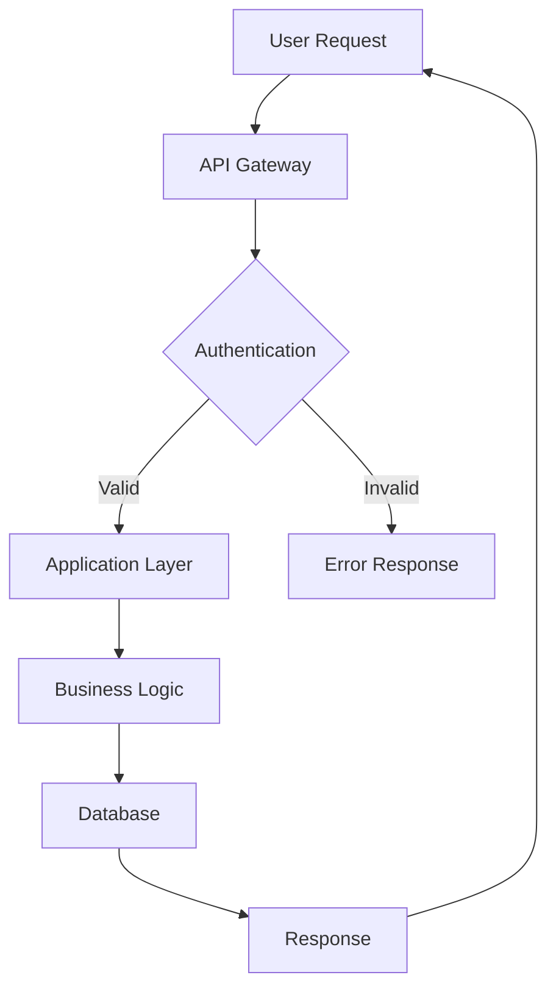
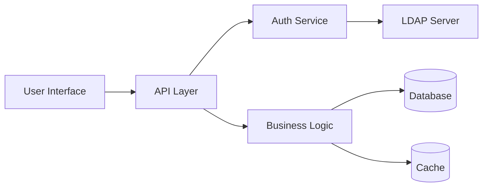
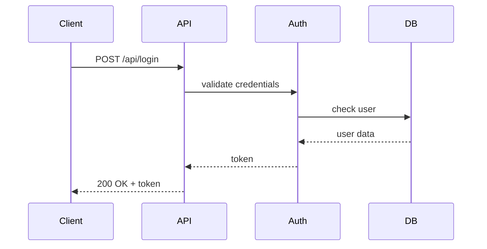
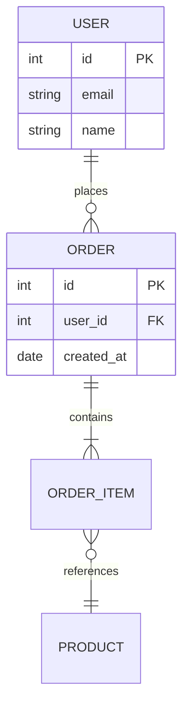
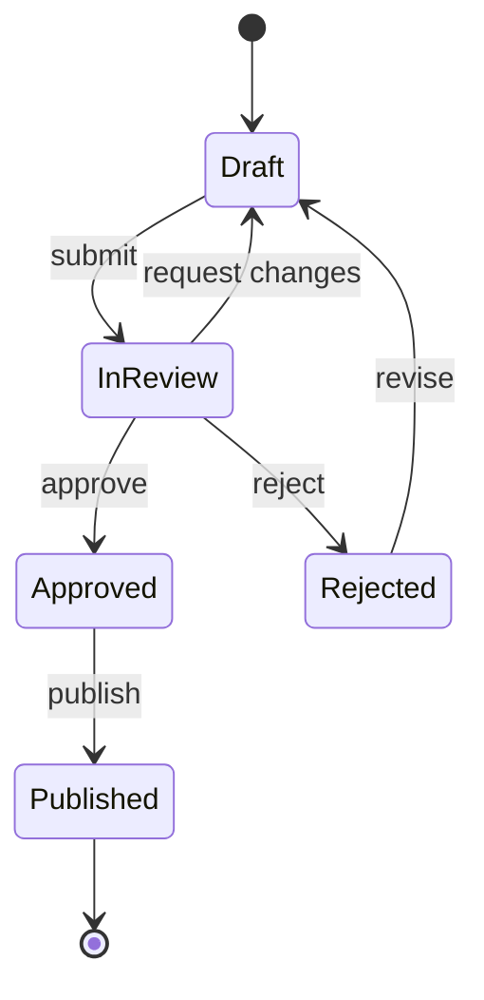
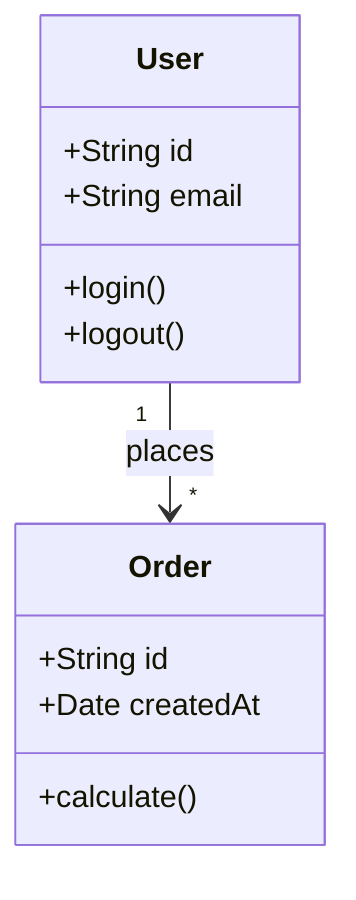
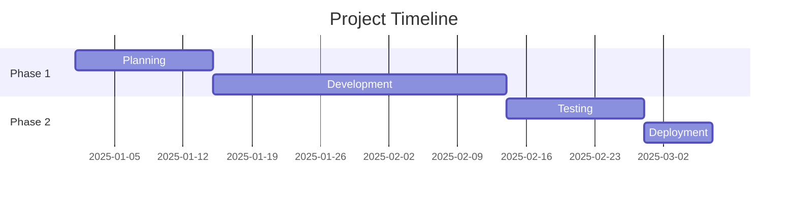
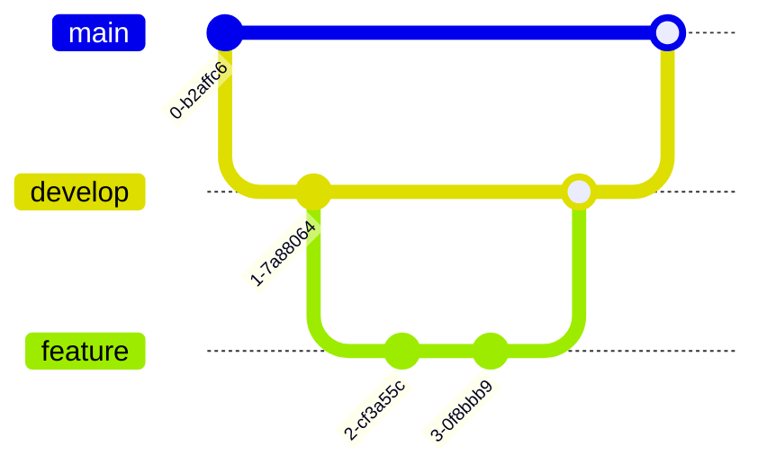
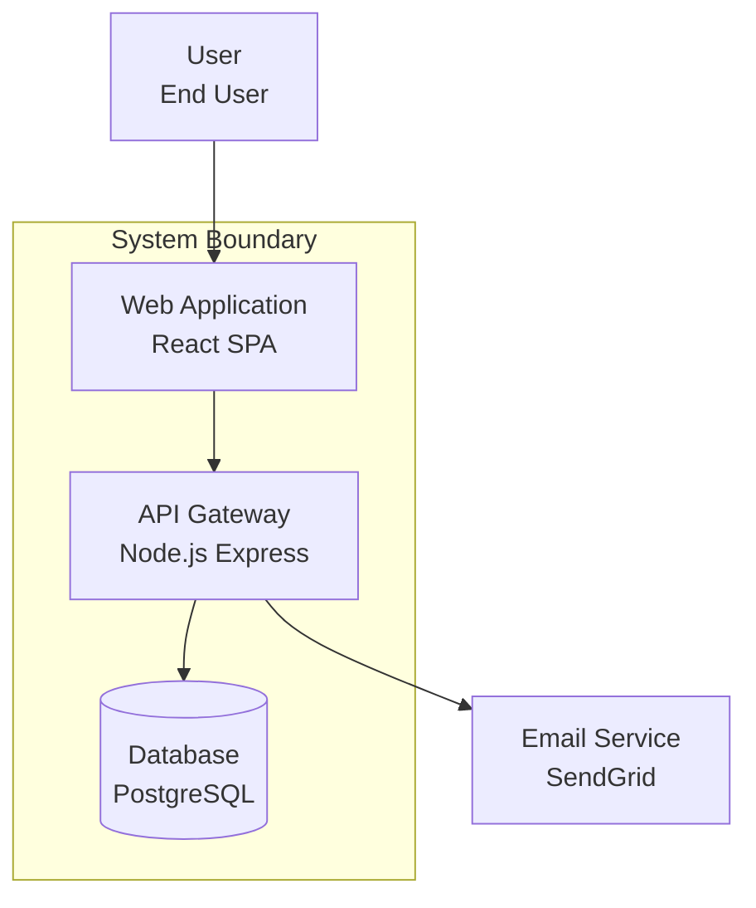
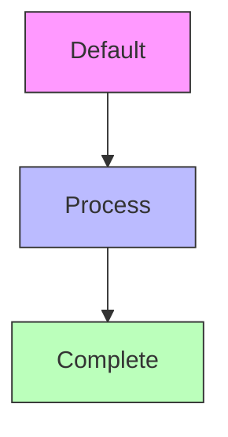

# Mermaid Diagram Examples and Guidelines

This knowledge base provides examples and best practices for creating Mermaid diagrams in project documentation.

## Mermaid Diagram Types and Examples

### 1. System Architecture (Flowchart)



### 2. Component Relationships (Graph)



### 3. API Flow (Sequence Diagram)



### 4. Entity Relationships



### 5. Cloud Architecture (Architecture Diagram - Recommended)

```mermaid
architecture-beta
    group api(cloud)[Public API]
        service web(server)[Web Server]
        service lb(disk)[Load Balancer]
    group private(cloud)[Private Services] in api
        service app(server)[Application Server]
        service db(database)[Database]
        service cache(disk)[Cache Layer]
    group external(cloud)[External Services]
        service cdn(cloud)[CDN]

    web:R --> L:app
    lb:T --> B:web
    app:R --> L:db
    app:R --> L:cache
    external:T --> B:api
    cdn:R --> L:web
```

### 6. State Machine



### 7. Class Diagram



### 8. Gantt Chart (Timeline)



### 9. Git Workflow



### 10. C4 Context Diagram



## Architecture Diagram Guide (Mermaid v11.1.0+)

The **Architecture diagram** is the recommended diagram type for cloud and infrastructure architecture.

### Core Concepts

**1. Groups** - Container for organizing related services
```
group {id}({icon})[{title}]
group {id}({icon})[{title}] in {parent_id}  // nested group
```

**2. Services** - Individual components/resources
```
service {id}({icon})[{title}]
service {id}({icon})[{title}] in {group_id}  // service in group
```

**3. Edges** - Connections with directional arrows
```
service1:R --> L:service2  // right to left
service1:T -- B:service2   // top to bottom
```

**4. Junctions** - Special nodes for multi-directional connections
```
junction j1
junction j2 in {group_id}
```

### Available Icons

**Built-in**: `cloud`, `database`, `disk`, `internet`, `server`

**Custom**: Use Iconify format `{provider}:{icon-name}` (e.g., `mdi:aws`, `fa:docker`, `fluent:azure`)

### Complete Architecture Example


## Best Practices

### Diagram Selection Guide

| Use Case                    | Recommended Diagram     | Alternative           |
| --------------------------- | ----------------------- | --------------------- |
| Cloud/Infrastructure        | architecture-beta       | flowchart             |
| System Architecture         | flowchart TD            | graph                 |
| API Flow                    | sequenceDiagram         | flowchart             |
| Data Model                  | erDiagram               | classDiagram          |
| Component Relationships     | graph LR                | flowchart             |
| State Transitions           | stateDiagram-v2         | flowchart             |
| Object-Oriented Design      | classDiagram            | graph                 |
| Project Timeline            | gantt                   | flowchart             |
| Version Control Flow        | gitGraph                | flowchart             |
| User Journey                | journey                 | sequenceDiagram       |

### Design Guidelines

**1. Keep It Simple**
- Limit diagrams to 10-15 nodes for readability
- Break complex systems into multiple focused diagrams
- Use subgraphs to organize related components

**2. Consistent Naming**
- Use clear, descriptive labels
- Follow project naming conventions
- Avoid abbreviations unless widely understood

**3. Direction and Layout**
- `TD` (Top-Down): For hierarchical systems, deployment pipelines
- `LR` (Left-Right): For data flows, sequential processes
- `architecture-beta`: For cloud infrastructure

**4. Add Context**
- Include titles for complex diagrams
- Add notes or annotations where helpful
- Link to detailed documentation when needed

**5. Accessibility**
- Use meaningful colors (not just decorative)
- Ensure sufficient contrast
- Provide text alternatives where appropriate

## Common Node Shapes

- `[Rectangle]` - Standard process/component
- `(Round)` - Start/end points
- `{Diamond}` - Decision points
- `[(Database)]` - Data storage
- `[/Parallelogram/]` - Input/output
- `[[Subroutine]]` - Predefined process

## Connection Types

- `-->` - Solid arrow (standard flow)
- `-.->` - Dotted arrow (optional/async)
- `==>` - Thick arrow (emphasized)
- `--` - Line without arrow (relationship)
- `-->|Label|` - Labeled connection

## Color and Styling



Define styles for semantic meaning:
- Success/complete: Green tones
- Warning/review: Yellow/orange tones
- Error/failed: Red tones
- Process/active: Blue tones
- Neutral/default: Gray tones

## Usage Guidelines

### When to Use Diagrams
- Explaining system architecture
- Documenting API flows
- Illustrating data relationships
- Showing deployment structures
- Mapping user journeys
- Planning project timelines

### When to Avoid Diagrams
- Simple linear processes (use lists)
- Frequently changing details (becomes maintenance burden)
- Overly complex systems (break into multiple diagrams)
- Information better suited for tables or text

### Maintenance Tips
1. Version control diagram source in code repositories
2. Update diagrams when system changes
3. Review diagrams during documentation reviews
4. Link diagrams to related documentation
5. Use consistent terminology across all diagrams
6. Consider automated diagram generation for dynamic systems

## References

- [Mermaid Official Documentation](https://mermaid.js.org/)
- [Mermaid Live Editor](https://mermaid.live/)
- [Iconify Icon Sets](https://icon-sets.iconify.design/)
- [C4 Model](https://c4model.com/)
