# Mermaid Diagram Examples and Guidelines

This knowledge base document provides examples and best practices for creating Mermaid diagrams in project documentation.

## Mermaid Diagram Types and Examples

### 1. System Architecture (Flowchart)

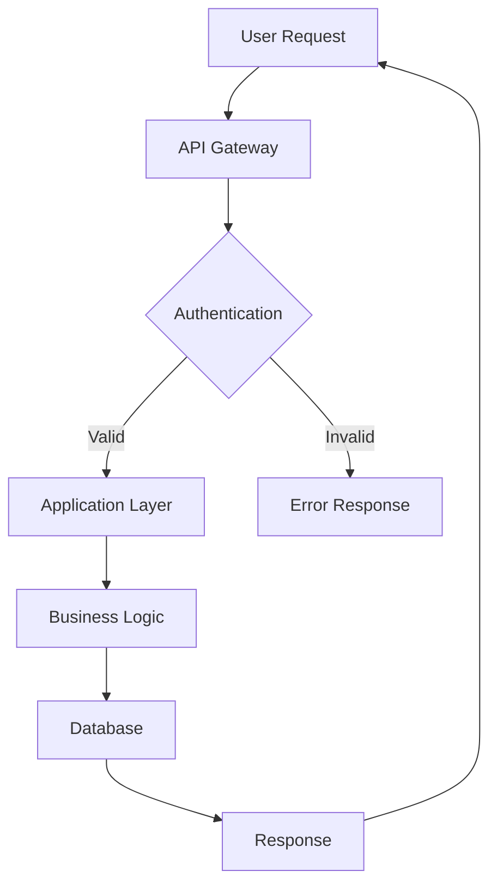

### 2. Component Relationships (Graph)

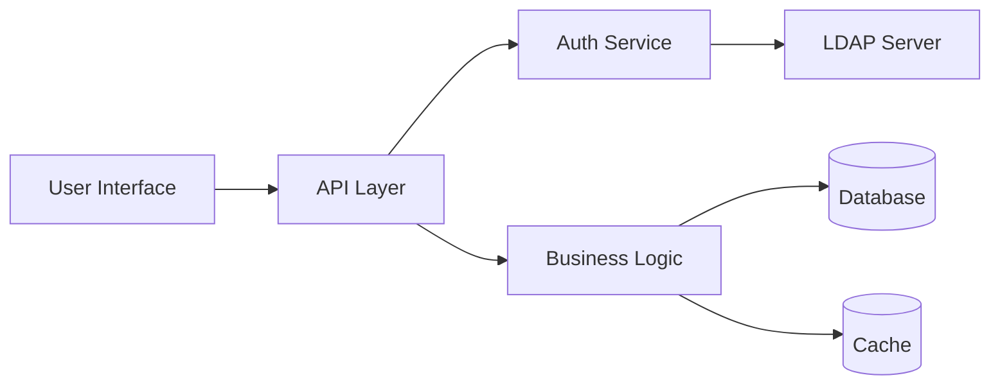

### 3. API Flow (Sequence Diagram)

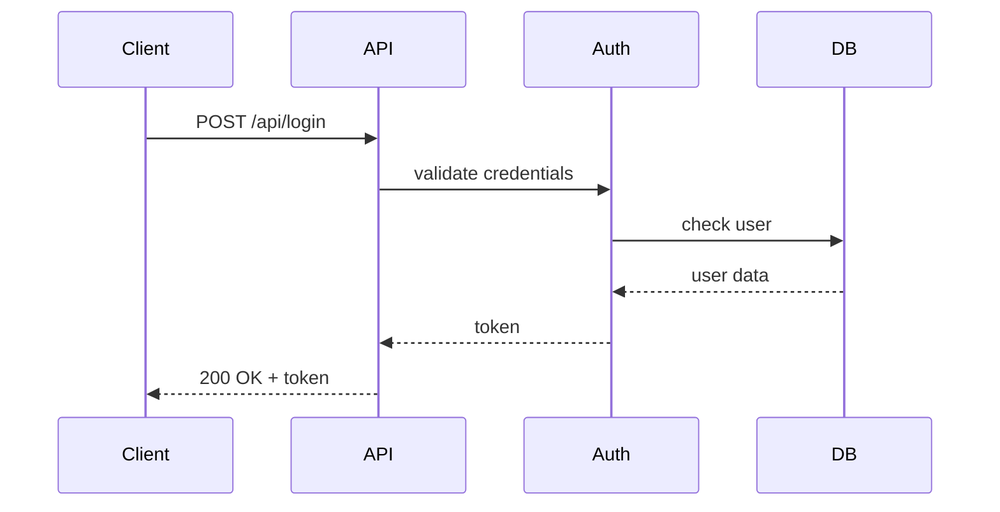

### 4. Entity Relationships

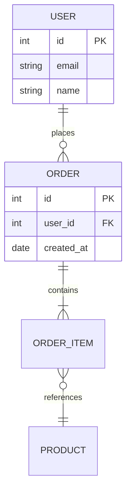

### 5. Cloud Architecture (Architecture Diagram - Recommended for Cloud)

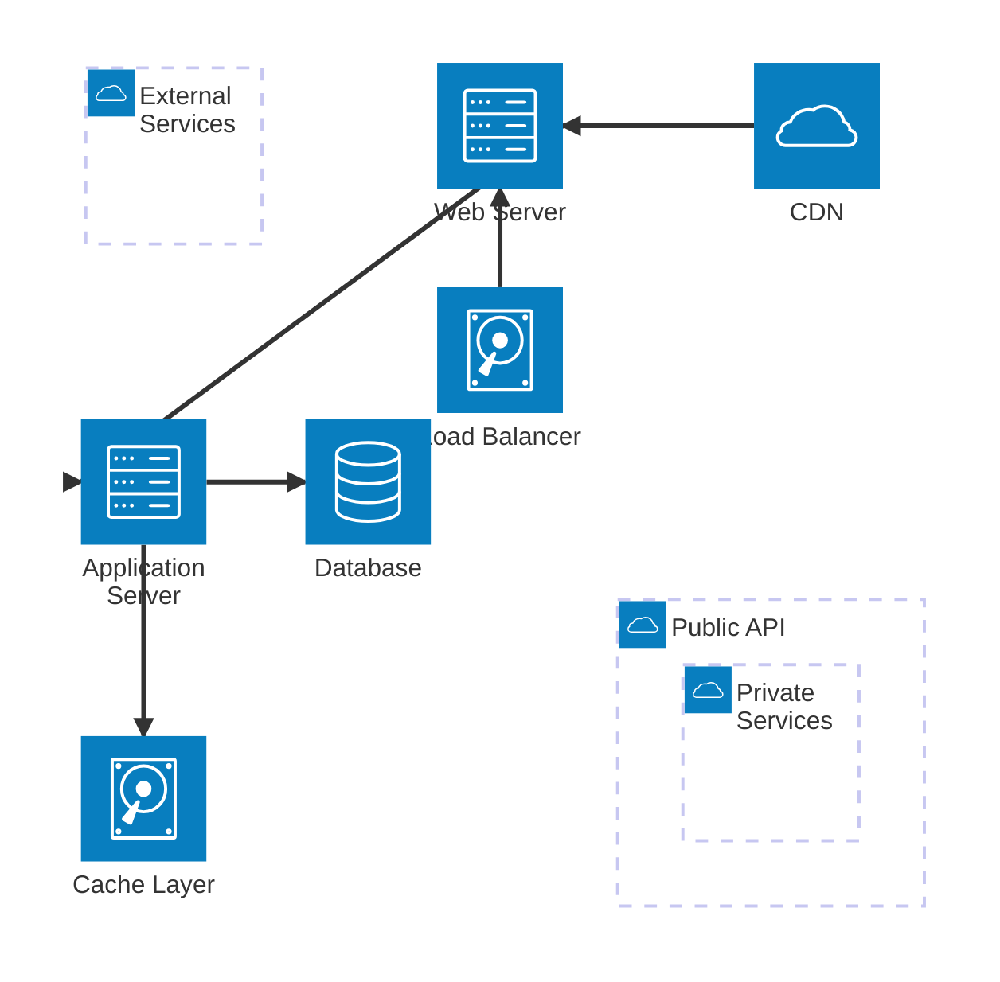

**Architecture Diagram Features:**

- Groups for organizing related services
- Built-in icons: `cloud`, `database`, `disk`, `internet`, `server`
- Support for custom Iconify icons (200,000+ available)
- Clean, modern cloud architecture visualization
- Services can be nested within groups using `in` keyword
- Edges with directional connectors (T|B|L|R for Top/Bottom/Left/Right)

### 5b. Deployment Architecture (Flowchart Alternative)

For more complex deployments or when more customization is needed, use flowchart:

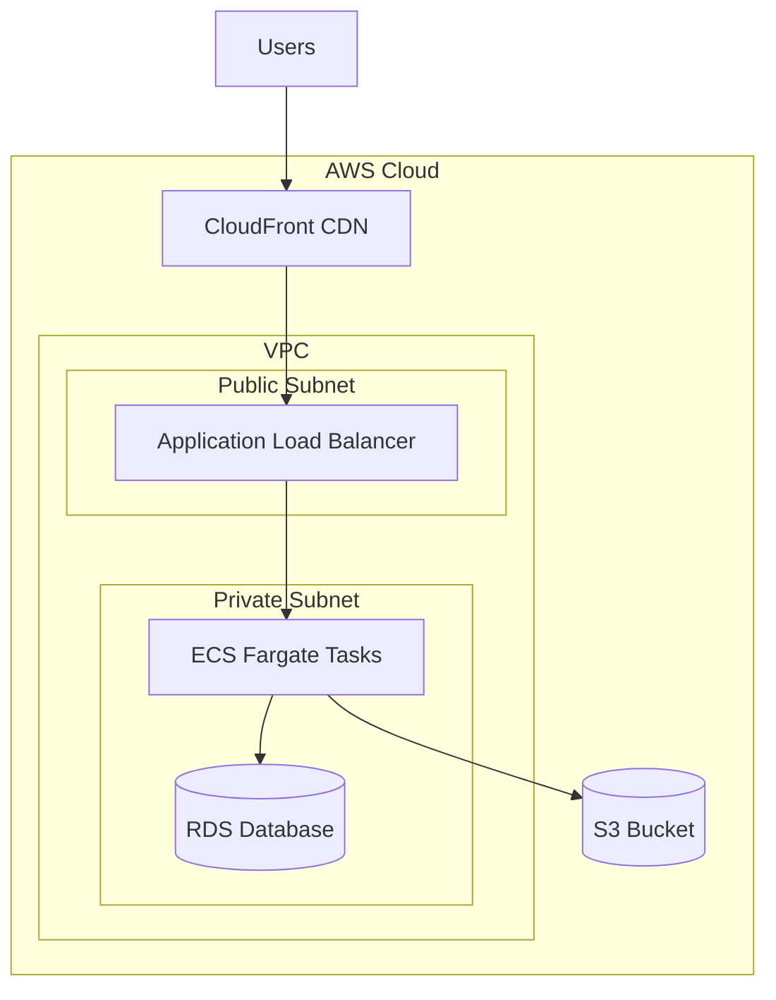

### 6. State Diagram

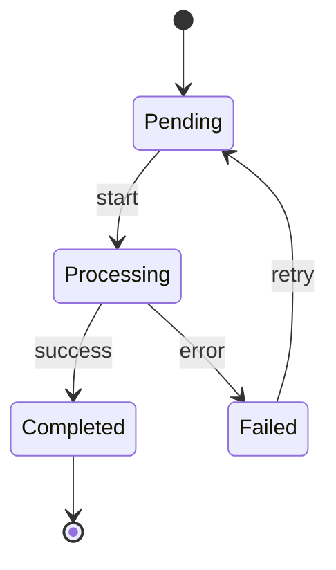

### 7. Class Diagram

```mermaid
classDiagram
    class User {
        +String id
        +String email
        +String name
        +login()
        +logout()
    }

    class Order {
        +String id
        +String userId
        +Date createdAt
        +addItem()
        +removeItem()
    }

    User ||--o{ Order : has
```

### 8. Gantt Chart

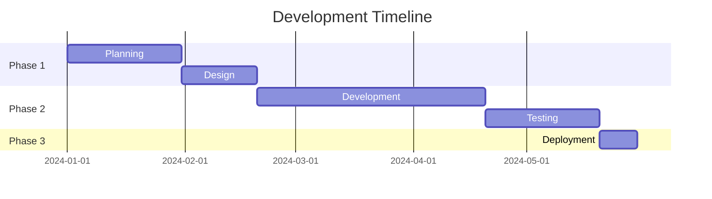

### 9. Git Flow Diagram

```mermaid
gitgraph
    commit
    branch develop
    checkout develop
    commit
    branch feature
    checkout feature
    commit
    commit
    checkout develop
    merge feature
    checkout main
    merge develop
    commit
```

### 10. C4 Context Diagram

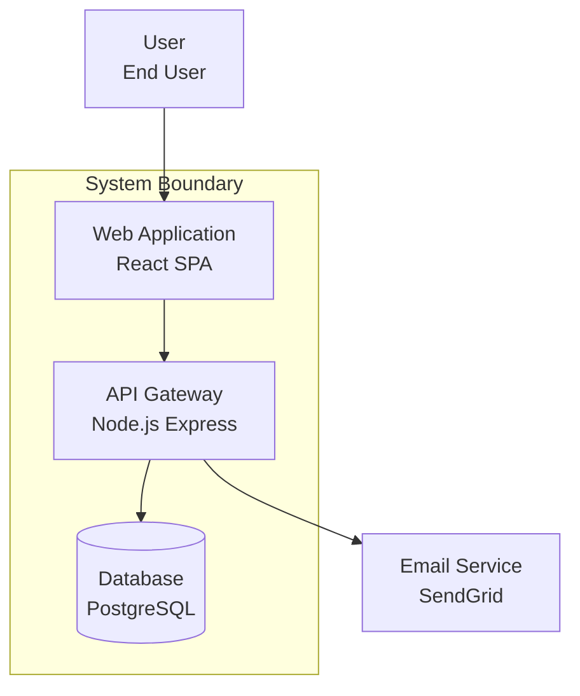

## Architecture Diagram Guide (Mermaid v11.1.0+)

The **Architecture diagram** is the recommended diagram type for cloud and infrastructure architecture. It provides a clean, modern way to visualize cloud deployments, microservices, and system components.

### Core Concepts

1. **Groups** - Container for organizing related services

   ```
   group {id}({icon})[{title}]
   group {id}({icon})[{title}] in {parent_id}  // nested group
   ```

2. **Services** - Individual components/resources

   ```
   service {id}({icon})[{title}]
   service {id}({icon})[{title}] in {group_id}  // service in group
   ```

3. **Edges** - Connections between services with directional arrows

   ```
   service1:R --> L:service2  // right of service1 to left of service2
   service1:T -- B:service2   // top to bottom
   ```

4. **Junctions** - Special nodes for multi-directional connections
   ```
   junction j1
   junction j2 in {group_id}
   ```

### Available Icons

**Built-in icons:**

- `cloud` - Cloud services
- `database` - Databases
- `disk` - Storage/disk
- `internet` - Internet/external
- `server` - Servers/compute

**Custom icons:**
Use any Iconify icon with format: `{provider}:{icon-name}`

Example: `mdi:aws`, `fa:docker`, `fluent:azure`

### Complete Architecture Example


### Edge Direction Reference

| Direction | Meaning |
| --------- | ------- |
| `:T`      | Top     |
| `:B`      | Bottom  |
| `:L`      | Left    |
| `:R`      | Right   |

### Edge Arrow Types

| Syntax | Meaning              |
| ------ | -------------------- |
| `-->`  | Arrow pointing right |
| `<--`  | Arrow pointing left  |
| `--`   | No arrow             |
| `<-->` | Bidirectional arrows |

### Nested Groups Example

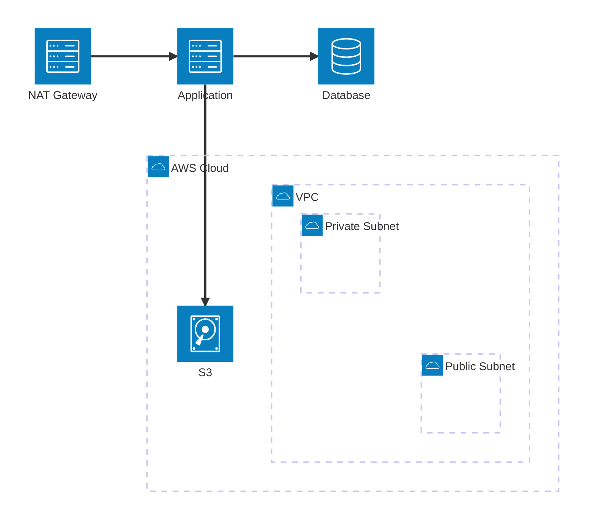

## Best Practices

### When to Use Architecture Diagrams

- Cloud infrastructure visualization
- Microservices architecture
- Network topology
- System component relationships
- Modern cloud deployments

### When to Use Flowcharts Instead

- Complex business logic workflows
- Conditional branching and decision trees
- Detailed process flows with many variations
- Legacy system documentation

### 1. Code Block Format

- Always use triple backticks with `mermaid` language identifier
- Example: ````mermaid`

### 2. Clear Labels

- Use descriptive node names instead of generic labels
- Good: `[User Authentication Service]`
- Bad: `[Service 1]`

### 3. Logical Flow

- Follow natural reading patterns (top-to-bottom, left-to-right)
- Use consistent direction throughout the diagram

### 4. Subgraphs

- Group related components using subgraphs
- Use meaningful subgraph titles
- Example: `subgraph "AWS Cloud"`

### 5. Styling

- Use consistent node shapes for similar components
- Databases: `[(Database)]`
- Services: `[Service Name]`
- Decisions: `{Decision Point}`

### 6. Documentation

- Include diagram explanations after each diagram
- Explain the purpose and key relationships shown

### 7. Accessibility

- Use descriptive text for all nodes and connections
- Avoid color-only differentiation

## Common Node Shapes

- `[]` Rectangle (default) - Services, components
- `()` Rounded rectangle - Processes
- `{}` Diamond - Decision points
- `(())` Circle - Start/end points
- `[()]` Stadium/pill shape - User interactions
- `[[]]` Subroutine - Sub-processes
- `[(Database)]` Database cylinder - Data stores
- `>Rectangle]` Asymmetric shape - External systems

## Connection Types

- `-->` Solid arrow - Standard flow
- `-.->` Dotted arrow - Conditional/optional flow
- `==>` Thick arrow - Important flow
- `--` Line without arrow - Association
- `-.` Dotted line - Weak association

## Color and Styling

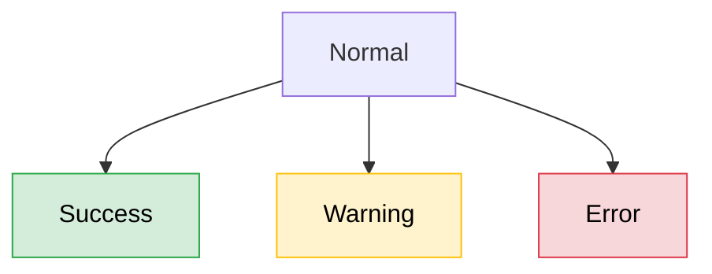

## Usage Guidelines

### When to Use Each Diagram Type

1. **Architecture** (NEW - v11.1.0+) - Cloud infrastructure, microservices, system components
2. **Flowchart** - System workflows, business processes, complex logic
3. **Graph** - Component relationships, network topology, general connections
4. **Sequence** - API interactions, message flows, timing diagrams
5. **ER Diagram** - Database schema, data relationships
6. **State Diagram** - Object lifecycles, status workflows
7. **Class Diagram** - Object-oriented design, code structure
8. **Gantt Chart** - Project timelines, development phases
9. **Git Graph** - Branch strategies, release workflows

### Integration with Documentation

This knowledge base is referenced by documentation commands:

- `/document` - Comprehensive project documentation
- `/api-docs` - API documentation with sequence diagrams
- `/arch-docs` - Architecture documentation with system diagrams
- `/deploy-docs` - Deployment documentation with infrastructure diagrams

All documentation commands will automatically reference these Mermaid formats when creating visual documentation.
